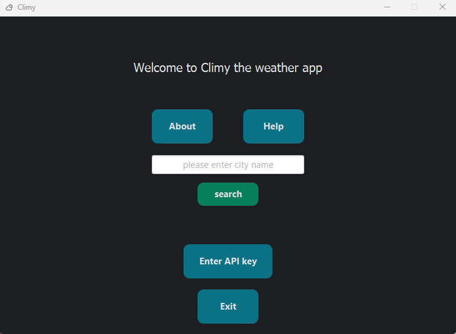
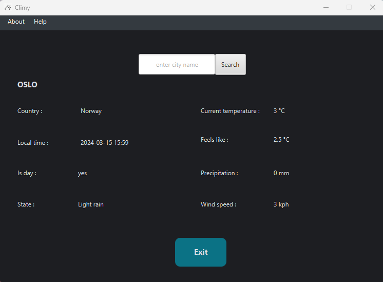

# Climy

A java app that give some detailed weather information about the requested geogaphical location. The requests the weather information from  ## WeatherAPI.com. 

# Details

The app was developed in java 17. The GUI was created using javafx 17.0.2. The networking is handeled using unirest library. The build and dependency amnagment tool used in the project is maven.

# Dependencies

As mentioned before the dependencies for the project are managed using maven. The project has the following dependencies:

- javafx-controls 17.0.2.
- javafx-fxml 17.0.2.
-  junit-jupiter-api 5.8.2 (not currently used, will be needed to implements tests)
- junit-jupiter-engine 5.8.2 (not currently used, will be needed to implements tests)
- unirest-java 1.4.9
- json 20220924

	

# Requirements

- For the current stage of the application developement and IDE is required to run the app (IntelliJ 2021.3.2)
- java should be installed of the machine in order to run the application
- An API key from https://www.weatherapi.com is also required

# Showcase

The application starts in the main menu view which looks like this:

The first steps is the input the API key:

afterwards you can start looking up weather infomation using the search functionality:

# Further development plans

The plan for further development is:

- Created an executable for the application from an uber-jar so that the app and all its dependecies are packaged and the user would not need to install anything on their machine.
- Set up some tests, and maybe a CI/CD wokflow to facilitate further development of app features.
- Add some features such as: get the history of the weather information of the specific location, get the forecast of the weather information of the specific location.

Any feature suggestion/bug report is welcome, just open a issue :).
